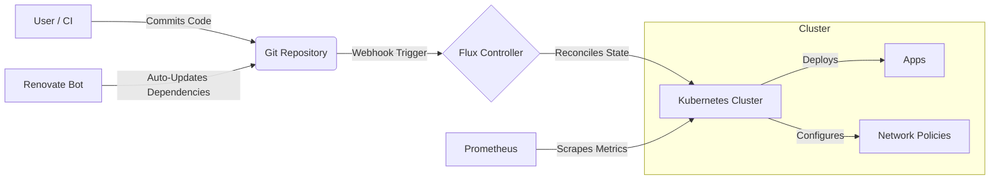

# Kubernetes GitOps Monorepo

## Overview

This repository acts as the **Single Source of Truth** for my Kubernetes infrastructure. It utilises **GitOps** principles to manage the cluster state, infrastructure, and application lifecycles.

The goal of this project is to demonstrate a production-ready approach to managing Kubernetes clusters using **Infrastructure as Code (IaC)**.

---

## Core Technology Stack

This project leverages the following technologies to ensure scalability, security, and automation:

| Category | Technology | Usage |
| :--- | :--- | :--- |
| **Orchestration** |  | Container orchestration and management. |
| **GitOps** |  | Continuous Delivery and cluster state reconciliation. |
| **IaC** |  | Provisioning underlying cloud/virtual resources. |
| **OS** |  | Base operating system for nodes. |
| **Scripting** |  | Automation scripts and custom controllers. |
| **Observability** | **Prometheus & Grafana** | Full stack monitoring, alerting, and metrics visualization. |
| **Networking** | **Ingress-Nginx & MetalLB** | Layer 7 traffic management and Layer 2 Load Balancing. |
| **Security** | **SOPS & Network Policies** | Secret encryption at rest and pod-to-pod traffic isolation. |

---

## Architecture & Workflow

Changes to the infrastructure are performed via Pull Requests. Once merged, Flux automatically synchronises the cluster state with the Git repository.


## Repository Structure

The repository is structured in conformity with the [monorepo](https://fluxcd.io/flux/guides/repository-structure/) methodology.
```
├── apps/                               # Application manifestst
│   ├── base/                           # Base Kustomize manifests (DRY principle)
│   └── staging/                        # Application-specific settings
├── clusters/                      
│   └── staging/                
│       └──  flux-system/               # Flux system components
            ├── gotk-components.yaml    # GitOps toolkit
            ├── gotk-sync.yaml          # GitOps toolkit - kind: GitRepository & kind: Kustomization (the Kustomization file below)
            └── kustomization.yaml      # The base template for Flux configured by default.
|   ├── .sops.yaml                      # Contains the public key for encryption
|   ├── apps.yaml                       # A Kustomization custom resource
|   ├── infrastructure.yaml             # Sync definition for infrastructure
│   └── monitoring.yaml            
├── infrastructure/                     # Core system components
│   └──  controllers/              
│       └── monitoring/
|           └── base
|               └── renovate
|           └── staging
|               └── renovate
```
## Secrets management with [SOPS](https://fluxcd.io/flux/guides/mozilla-sops/)

#### Encrypting secrets using age
```
brew install sops age

# Creates the public and private keys
# The private key should be stored separately in case
# the cluster has to be rebuilt in the future.
age-keygen -o age.agekey

# Export the pubkey into a variable
export AGE_PUBLIC=<public_key>

# Encrypt the yaml definition of the secret with the pubkey
sops --age=$AGE_PUBLIC \
--encrypt --encrypted-regex '^(data|stringData)$' --in-place secret.yaml

# Add the **private key** to the cluster.
# With this the encrypted secrets are decrypted inside the cluster
cat age.agekey |
kubectl create secret generic sops-age \
--namespace=flux-system \
--from-file=age.agekey=/dev/stdin
```

## Flux
#### Installing Flux
Flux needs to be installed on the cluster to facilitate the GitOps reconciliation loop

Bootstrapping Flux on the Cluster

```
export GITHUB_TOKEN=<your-token>
export GITHUB_USER=<your-username>

# Install Flux CLI
curl -s https://fluxcd.io/install.sh | sudo bash

# Check if the cluster meets the requirements
# Kubernetes 1.28.0.0 or newer is required
flux check --pre

flux bootstrap github \

  --owner=$GITHUB_USER \

  --repository=<repo_name> \

  --branch=main \

  --path=./clusters/staging \

  --personal
```

This installs Flux controllers in a separate namepsace and commits manifests to the specified repository.
Flux creates necessary manifests in the GitHub repository.

#### What is a Kustomization?
A **Kustomization** custom resource represents a local set of Kubernetes resources (e.g. kustomize overlay) the Flux is supposed to reconcile in the cluster.
The reconciliation runs every five minutes by default which can be changed by **.spec.interval**.

#### How does Flux deploy the application?
  1. Flux reads the clusters/staging directory

  2. Finds and applies our apps.yaml file

  3. Looks at the apps/staging directory

  4. Finds the applications kustomization file

  5. Applies the resources we defined in the base configuration

## Configuring Cloudflare Tunnels [manual](https://developers.cloudflare.com/cloudflare-one/networks/connectors/cloudflare-tunnel/do-more-with-tunnels/local-management/create-local-tunnel/)
#### Installation of cloudflared

```
sudo mkdir -p --mode=0755 /usr/share/keyrings
curl -fsSL https://pkg.cloudflare.com/cloudflare-public-v2.gpg | sudo tee /usr/share/keyrings/cloudflare-public-v2.gpg >/dev/null
echo "deb [signed-by=/usr/share/keyrings/cloudflare-public-v2.gpg] https://pkg.cloudflare.com/cloudflared any main" | sudo tee /etc/apt/sources.list.d/cloudflared.list
sudo apt-get update && sudo apt-get install cloudflared
```

